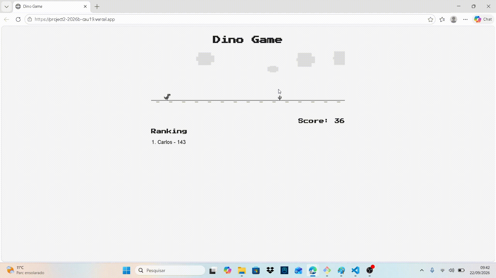

# Projeto: Dino Game com persistência de dados em backend

> `demo.gif` ainda não existe. Depois de jogar uma partida, grave a tela (ex: ScreenToGif, Xbox Game Bar
> `Win+G`, ou o gravador de tela do navegador) e salve o arquivo como `demo.gif` na raiz do repositório.

## Acesso

> ⚠️ **Ainda não há deploy público.** O banco de dados já é o Supabase (PostgreSQL) de verdade, mas o
> jogo só roda localmente por enquanto (`npm start`, `http://localhost:3000`). A URL pública será
> adicionada aqui depois do deploy (Vercel/Render — veja [TUTORIAL.md](./TUTORIAL.md)).

## Desenvolvedor(a)

Carlos Henrique Mendina Gonçalves Pereira — Engenharia de Computação

## Proposta

Jogo estilo "Dino Game": um personagem parado no canto esquerdo da tela desvia de obstáculos (pulando)
para sobreviver o maior tempo possível. Não há autenticação/login; o jogador apenas informa um nome ao
final da partida para entrar em uma tela de ranking com os maiores scores. O frontend se comunica com o
backend por meio de uma API (leitura e escrita), e os dados de ranking são persistidos do lado do
servidor.

Modalidade: **B** (parceria com colega usuário/cliente, para feedback de funcionalidades e interface).

## Parceria/cliente/usuário

> A definir. Modalidade B: encontre um(a) colega para jogar sua versão e dar feedback sobre a
> experiência (não sobre o código).

## Feedback/comentário da parceria/cliente/usuário

> A ser preenchido pelo(a) colega parceiro(a), com foco em funcionalidades e interface (modalidade B).

## Desenvolvimento

### Processo

> **Esta seção deve ser escrita por você, em primeira pessoa, sem ajuda de IA** (é uma exigência do
> enunciado do projeto). Use o [TUTORIAL.md](./TUTORIAL.md) como referência do que foi feito, mas
> escreva com suas próprias palavras: o que você já sabia, o que aprendeu, que dúvidas teve (ex: como
> funciona a física do pulo? por que usar SQLite antes de um banco "de verdade"? como funcionou a
> colisão?), que dificuldades apareceram e como resolveu.

### Trechos de código

> Escolha pelo menos 3 trechos para destacar e explique cada um com suas palavras. Sugestões de onde
> olhar, já que são os pontos mais didáticos do projeto:
> 1. A física do pulo em [game.js](./public/game.js) (variáveis `velocityY` e `GRAVITY`).
> 2. A detecção de colisão por retângulos (`rectsOverlap`) em [game.js](./public/game.js).
> 3. As rotas da API (`GET /api/scores` e `POST /api/scores`) em [server.js](./server.js).

## Tecnologias

### Linguagens e afins

- JavaScript (frontend com HTML5 Canvas, e backend com Node.js)
- HTML5 e CSS3
- Node.js + Express (servidor web e API REST)
- Supabase / PostgreSQL (`@supabase/supabase-js`) — banco de dados real, em uso atualmente
- Row Level Security (RLS) no Postgres, com policies restringindo a chave pública a apenas
  leitura e inserção de scores (sem update/delete)

### Ambiente de desenvolvimento

- VS Code
- Claude Code (assistente de IA, usado para montar a estrutura inicial do projeto e o tutorial de
  desenvolvimento — o código e o processo de aprendizado foram revisados e explicados por mim)
- Node.js / npm
- Git e GitHub

## Referências e créditos

- [Documentação do Express](https://expressjs.com/pt-br/)
- [MDN — Canvas API](https://developer.mozilla.org/pt-BR/docs/Web/API/Canvas_API)
- [Documentação do Supabase](https://supabase.com/docs)
- [Documentação do supabase-js](https://supabase.com/docs/reference/javascript/introduction)
- [Documentação de Row Level Security do Supabase](https://supabase.com/docs/guides/database/postgres/row-level-security)
- Ideia original do "Dino Game" proposta por Ricardo Facco Pigatto no documento de definições da
  disciplina.

---
Projeto entregue para a disciplina de [Desenvolvimento de Software para a Web](http://github.com/andreainfufsm/elc1090-2026b) em 2026b
